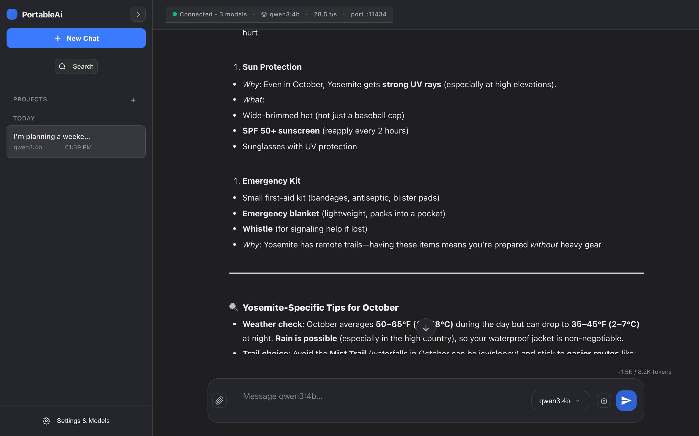
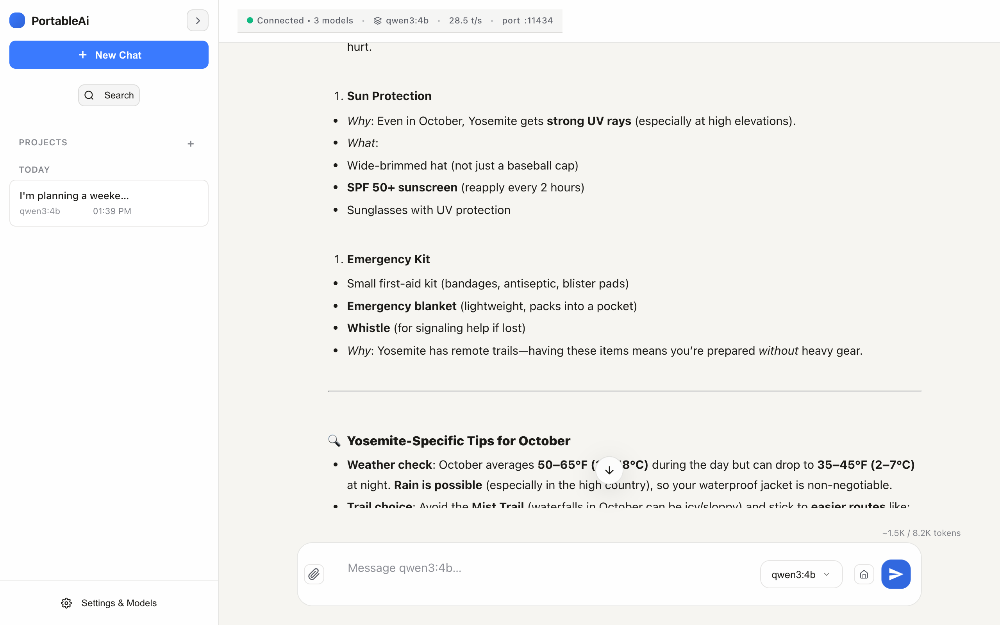
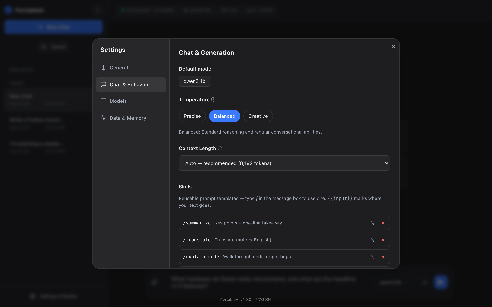
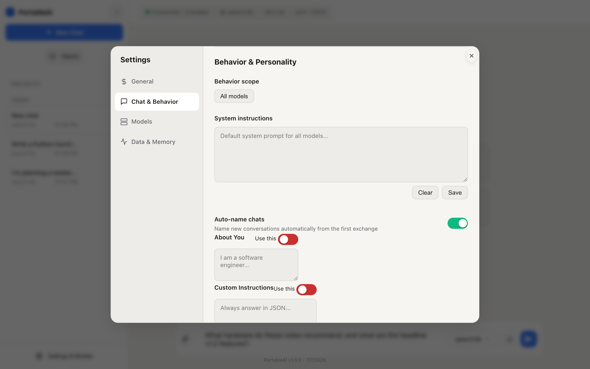
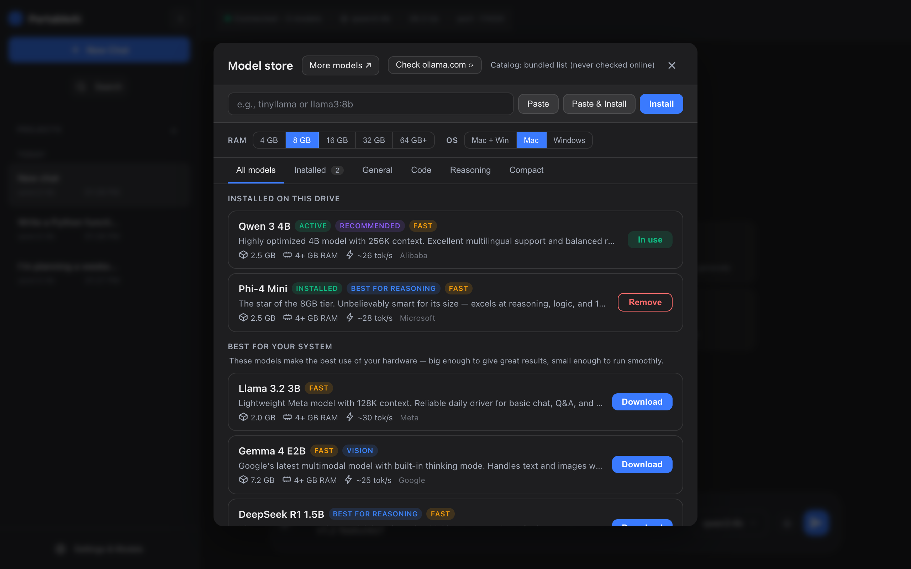
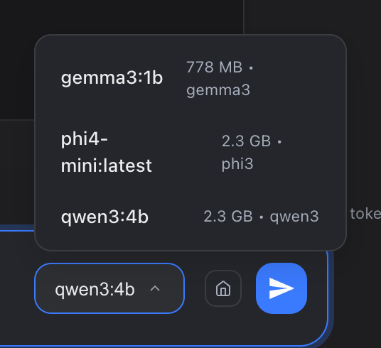
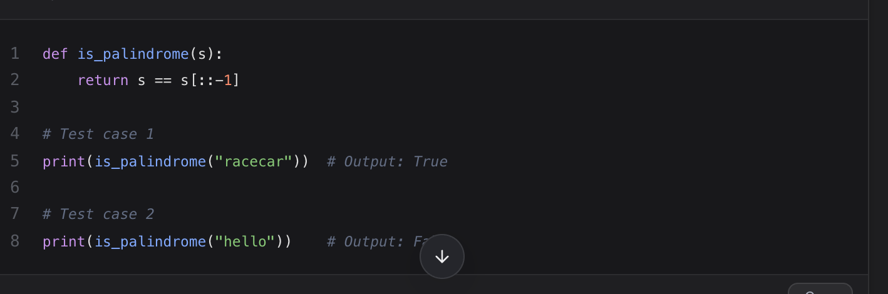
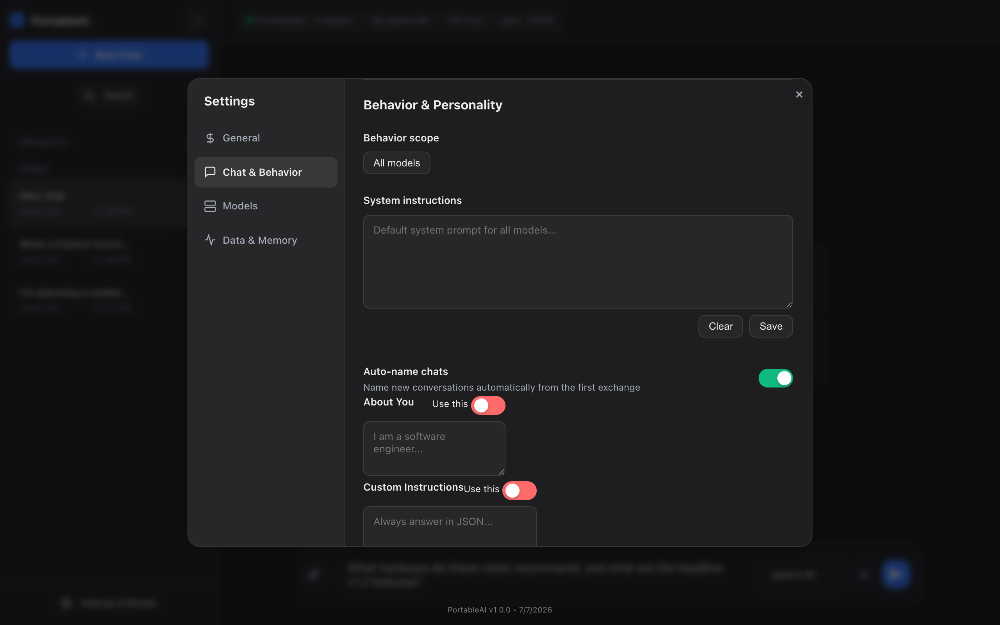

# Portable AI

A cross-platform portable LLM app. Download a model once, then run anywhere with no internet.

**[Get it free on Gumroad](https://seyijohnson.gumroad.com/l/portable-ai)**



## What This Is

An Electron app that bundles [Ollama](https://ollama.com) on a single exFAT-formatted USB drive. Plug it into any Mac or Windows machine, double-click, and chat with a local LLM. No installation on the host computer. No cloud. No accounts.

The same physical drive works on both operating systems.

## Why

Every portable AI tool is locked to one platform. [OffGrid AI](https://www.offgridai.app/) is Windows-only and costs $129-$469. Products like [Vision1 Mini](https://vision1.ai/) and [Docket Mini](https://docket.ai/) are hardware-locked to a single OS. This project works on Mac *and* Windows from the same drive, and the source code is available.

## Features

- **Streaming chat** - real-time token-by-token responses via Ollama's `/api/chat` endpoint
- **Model Store** - browse and download models filtered by RAM, OS, and category, with download progress and drive space indicator
- **Model selector** - switch models mid-conversation from the input area
- **Dark and light themes** - with 6 accent colors (purple, blue, green, orange, pink, teal)
- **Markdown and code rendering** - headings, lists, tables, blockquotes, and syntax-highlighted code blocks with copy button
- **Conversation history** - sidebar with saved sessions, search, rename, and delete
- **Settings panel** - 6 tabs: General, Chat & Generation, Models, Behavior & Personality, Memory, Model Overrides
- **Personalization** - system instructions, "About You" field, custom instructions, base style presets, and tone presets
- **Memory system** - opt-in persistent memory across conversations with auto-cleanup, retention limits, and management UI
- **Temperature and context controls** - Precise / Balanced / Creative presets; configurable context length up to 16k tokens
- **First-run setup wizard** - hardware detection, model recommendation by RAM, theme selection, guided download with progress and ETA
- **Cross-platform portability** - same exFAT drive works on Mac and Windows; embedded Ollama starts and stops automatically
- **Full app migration** - copy the entire app to a new drive from within the UI
- **Emergency stop scripts** - auto-generated kill scripts for Mac (`stop.command`) and Windows (`stop.bat`)
- **Keyboard shortcuts** - `Cmd/Ctrl+B` sidebar, `Cmd/Ctrl+K` new chat, `Enter` send, `Shift+Enter` newline
## Screenshots

| Dark Mode | Light Mode |
|-----------|------------|
|  |  |

| Settings (Chat & Generation) | Settings (Personality) |
|------------------------------|------------------------|
|  |  |

| Model Store | Model Selector |
|-------------|----------------|
|  |  |

| Code Highlighting | Personality (Dark) |
|-------------------|--------------------|
|  |  |

## Quick Start

### Requirements

- USB 3.0+ drive (USB 2.0 works but model loading will be slow)
- 8 GB RAM minimum (16 GB recommended)
- macOS 12+ or Windows 10/11
- Internet connection for the first-time model download only

### Setup

1. Format your USB drive as **exFAT** (works on both Mac and Windows)
2. **[Download free on Gumroad](https://seyijohnson.gumroad.com/l/portable-ai)** and extract it to the drive
3. Launch the app:
   - **Mac:** Double-click `PortableAI.app`
   - **Windows:** Double-click `PortableAI.exe`
4. The setup wizard will walk you through choosing a theme and downloading a model (one-time, requires internet)
5. Done. After the initial download, the app works fully offline.

> **Note:** Ollama binaries are included in the release. You don't need to install Ollama separately. You only need internet once to pull a model.

### Daily Use

1. Plug the drive into any Mac or Windows machine
2. Double-click the app
3. Chat

## How It Works

### Directory Structure

```
USB Drive (exFAT)
+-- PortableAI.app/              # macOS app bundle
|   +-- Contents/
|       +-- Resources/
|           +-- ollama-darwin    # embedded Ollama binary
+-- PortableAI.exe               # Windows launcher
+-- app_data/
    +-- models/                  # Ollama model blobs and manifests
    |   +-- blobs/
    |   +-- manifests/
    +-- data/
    |   +-- sessions/            # saved chat history (JSON)
    |   +-- ollama.log           # runtime log
    +-- config/
    |   +-- portable-settings.json  # internal config
    |   +-- settings.json           # user preferences (theme, accent, etc.)
    +-- resources/               # user-placed override binaries
    +-- scripts/
    |   +-- stop.command         # emergency kill script (Mac)
    |   +-- stop.bat             # emergency kill script (Windows)
    +-- windows/                 # unpacked Electron app (Windows only)
        +-- PortableAI.exe       # actual Electron executable
```

> On Windows, the root `PortableAI.exe` is a lightweight launcher that sets up the working directory and hands off to `app_data/windows/PortableAI.exe`. Run the one at the root.

### Launch Sequence

1. **`main.js`** resolves the portable root. On macOS it walks up from the `.app` bundle; on Windows it uses the `.exe` directory.
2. `app_data/` subdirectories are created if they don't exist.
3. Old path layouts (`ollama_models/`, `appdata/`, `ollama-embedded.log`) are migrated automatically.
4. A free port is found in the **11434-11440** range via TCP probe.
5. The embedded Ollama binary is located (checking `app_data/resources/` for overrides, then the bundled binary, then fallbacks).
6. On macOS, the binary gets `chmod 755` and `xattr -rd com.apple.quarantine` to bypass Gatekeeper.
7. Ollama is spawned with `serve`, pointing `OLLAMA_MODELS` at `app_data/models/` and `OLLAMA_HOST` at `127.0.0.1:<port>`.
8. The app waits ~3 seconds, confirms Ollama is responding via `/api/tags`, and writes a `runtime.json`.
9. The first available model is preloaded into RAM (fire-and-forget).
10. The Electron BrowserWindow loads `webui/index.html`.
11. On quit, Ollama is killed and `runtime.json` is cleaned up.

## Requirements

| Resource | Minimum | Recommended |
|----------|---------|-------------|
| RAM | 8 GB | 16+ GB |
| USB Speed | USB 2.0 | USB 3.0+ |
| macOS | 12 Monterey | 13+ |
| Windows | 10 | 11 |
| Drive Size | 16 GB | 64 GB+ |
| Drive Format | exFAT | exFAT |

## Model Recommendations

Any model from the [Ollama library](https://ollama.com/library) works. The setup wizard recommends one based on your detected RAM. Here are tested options:

| RAM | Model | Size | Notes |
|-----|-------|------|-------|
| 8 GB | Gemma 3 4B, Phi-4 Mini (3.8B), Llama 3.2 3B | ~2-3 GB | Good for Q&A, writing, and light coding |
| 8 GB | Mistral 7B, Qwen 3 8B | ~4-5 GB | Faster (Mistral) or smarter (Qwen) at this tier |
| 16 GB | Phi-4 14B, Gemma 3 12B, DeepSeek-R1 14B | ~8-9 GB | Strong general-purpose and reasoning performance |
| 16 GB | Qwen 2.5 Coder 14B | ~9 GB | Top local coding model at this size |
| 32 GB+ | Llama 3.3 70B (Q4), Qwen 2.5 32B, Gemma 4 27B | ~20-40 GB | Near-cloud quality; slower on USB |

All sizes are approximate at Q4_K_M quantization. The Model Store filters recommendations by your detected RAM automatically.

## Comparison

| Feature | Portable AI | OffGrid AI | Vision1 Mini | Docket Mini |
|---------|-------------|------------|--------------|-------------|
| Price | **Free** | $129-$469 | ~$40-50 | ~$30-60 |
| macOS | Yes | No | No | Yes |
| Windows | Yes | Yes | Yes | Yes |
| Cross-platform (same drive) | Yes | No | No | No |
| Source available | Yes | No | No | No |
| Choose your own model | Yes | Limited | Limited | Limited |
| Hardware included | No (BYO drive) | Yes | Yes | Yes |

## FAQ

**Do I need internet?**

Only once, to download an AI model through the built-in Model Store. After that, everything runs offline.

**What models can I use?**

Any model from the [Ollama library](https://ollama.com/library). The setup wizard recommends a model based on your available RAM. Popular choices include Gemma 3, Phi-4 Mini, Llama 3.2, Qwen 3, and DeepSeek-R1.

**How fast is it?**

On a MacBook with 16 GB RAM, expect 20-40 tokens/second with a mid-size model at Q4_K_M quantization. First launch takes 30-90 seconds to load the model into memory; after that, responses stream in quickly. USB 3.0+ makes a significant difference over USB 2.0.

**Is this just Ollama with a wrapper?**

Ollama handles model inference. Portable AI adds the full user experience on top: a chat interface with markdown and code highlighting, conversation history, a model store with RAM-based filtering, theme and accent customization, system instructions and personality settings, a memory system, per-model overrides, a setup wizard, cross-platform portability from a single USB drive, and an embedded Ollama lifecycle that starts and stops automatically. You never touch a terminal.

**Can I use this without a USB drive?**

Yes. The app runs from any folder on your local disk. A USB drive gives you portability between machines, but it works fine from your desktop or an external SSD.

**How do I update the app?**

Download the latest release and replace the app files on your drive. Your models, conversations, and settings live in `app_data/` and are preserved across updates.

**Does it work with Apple Silicon?**

Yes. The bundled Ollama binary runs natively on Apple Silicon (M1/M2/M3/M4) Macs. Performance is strong because Apple Silicon's unified memory means the full system RAM is available for model inference.

**Can I run multiple models?**

You can download as many models as your drive has space for. Switch between them mid-conversation using the model selector in the input area. Only one model is loaded into RAM at a time.

## Troubleshooting

### macOS: "PortableAI is damaged" or Gatekeeper block

The app is not code-signed. Run this once:

```bash
xattr -rd com.apple.quarantine /Volumes/YOUR_DRIVE/PortableAI.app
```

Or right-click the app, then Open, then Open again on first launch.

### Slow first load

The first launch takes longer because Ollama loads the model into RAM from the USB drive. Subsequent prompts are much faster. USB 3.0+ makes a big difference. USB 2.0 can take 30-60 seconds for the initial model load.

### Port conflicts

If you see "port in use" errors, another Ollama instance (or a previous crash) may be holding the port. The app tries ports 11434-11440 automatically. If all are taken, use the emergency stop script:

- **Mac:** Double-click `app_data/scripts/stop.command`
- **Windows:** Double-click `app_data/scripts/stop.bat`

### Out of memory

If the app crashes or responses are garbled, your model is too large for your available RAM. Switch to a smaller model in the Model Store.

## Roadmap

- [ ] Linux support
- [ ] Auto-update mechanism
- [ ] RAG / document upload
- [ ] Image generation
- [ ] Voice input/output
- [ ] Multi-user support
- [ ] Plugin system

## Building from Source

```bash
# Clone the repo
git clone https://github.com/isthatseyi/portable-ai.git
cd portable-ai

# Install dependencies
npm install

# Run in development mode
npm start

# Package for distribution
npm run dist          # current platform
npm run dist:all      # macOS + Windows + Linux

# Build unpacked (for testing)
npm run pack
```

You'll need to supply your own Ollama binaries before packaging:

- **macOS:** Place `ollama-darwin` in `resources/`
- **Windows:** Place `ollama.exe` in `resources/`

See `package.json` for `build.mac.extraResources` and `build.win.extraResources` paths.

## License

Copyright (c) 2026 Sammuel Oluwaseyi Johnson. All Rights Reserved. See [LICENSE](LICENSE) for details.
